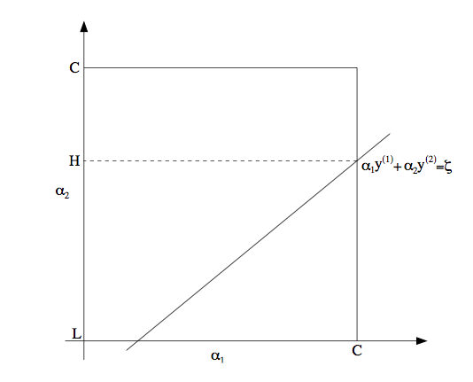

## SVM 笔记

### 1. 优化目标函数说明

#### 1.1 原始目标函数

原始目标即寻找一个最大间隔平面，优化目标函数如下：

$$
\min_{\arg \omega,b}{\frac{1}{2}||\omega||^2}
$$

其中$$$\omega$$$满足下面的约束条件：

$$
y_i(\omega \cdot x_i + b) - 1 \geq 0,\;\;i = 1,2,...,N
$$

假设最优解$$$\omega^{\star},b^{\star} $$$由此可以得到所谓的分离超平面：

$$
\omega^{\star} \cdot x+b^{\star} =0 
$$

分类决策函数为：

$$
f(x) = sign(\omega^{\star} \cdot x+b^{\star})
$$

#### 1.2 引入拉格朗日乘数的对偶优化函数

由于存在约束条件，为了解决上面的最优化问题，可以引入拉格朗日乘数来重新定义优化目标，并且转换到对偶问题上，上面的问题变为：

$$
\min_{\arg \alpha}\frac{1}{2}\sum\_{i=1}^{N}\sum\_{j=1}^{N}{\alpha_i\alpha_jy_iy_j(x_i\cdot x_j)}-\sum\_{i=1}^{N}\alpha_i
$$

其中约束条件变为：

$$
s.t.\; \; \sum\_{i=1}^Na_iy_i=0 ,\;\;\; \alpha_i \geq 0,\;\;\; i=1,2,...,N
$$

注意上面的两个对偶问题成体的充分必要条件是KTT条件。

#### 1.3 引入松弛变量

由于1.2约束条件过于严格，常常有些样本无法完全线性可分，因此必须考虑错误分类的样本，将1.1原始目标函数修改为：

$$
\min_{\arg \omega,b,\xi}{\frac{1}{2}||\omega||^2}＋C\sum\_{i=1}^N\xi_i
$$

其中约束条件修改为：

$$
y_i(\omega \cdot x_i + b) - 1 \geq 1-\xi_i,\;\;\xi_i > 0\;\;i = 1,2,...,N
$$

在这样的约束条件下，重新引入拉格朗日乘数，并进行对偶转换，新的优化目标函数为：

$$
\min_{\arg \alpha}\frac{1}{2}\sum\_{i=1}^{N}\sum\_{j=1}^{N}{\alpha_i\alpha_jy_iy_j(x_i\cdot x_j)}-\sum\_{i=1}^{N}\alpha_i
$$

其中约束条件变为：

$$
s.t.\; \; \sum\_{i=1}^Na_iy_i=0 ,\;\;\; 0\le \alpha_i \le C,\;\;\; i=1,2,...,N
$$

如求得最优解$$$\alpha^\star$$$, 那么$$$\omega^{\star},b^{\star} $$$可以按下面公式计算：

$$
\omega^{\star} = \sum\_{i=1}^{N}{a_i^\star y_i x_i}
$$


选择一个$$$\alpha_k^{\star}$$$ 满足 $$$0\le a_k^{\star} \le C $$$，计算：

$$
b^\star = y_k - \sum_{i=1}^N{y_i \alpha^\star(x_i\cdot x_j)} 
$$

这样的话，新的判别函数为：

$$
f(x) = sign(\omega^{\star} \cdot x+b^{\star})
$$

#### 1.4 KTT条件

上述的对偶问题成立的充分必要条件为KTT条件，即：


```
if 0 < alphas(i) < C then E(i)Y(i) = 0 
if alphas(i) == 0 then E(i)Y(i) >= 0
if alphas(i) == C then E(i)Y(i) <= 0
```


#### 1.5 引入核函数

为了实现非线性分隔样本，可以引入核函数将样本空间映射到特征空间，并且在特征空间寻找线性分隔超平面。这样的最优化目标为：

$$
\min_{\arg \alpha}\frac{1}{2}\sum\_{i=1}^{N}\sum\_{j=1}^{N}{\alpha_i\alpha_jy_iy_jK(x_i\cdot x_j)}-\sum\_{i=1}^{N}\alpha_i
$$

约束条件相同，间隔平面参数和判别函数对应把内积操作修改为核函数即可。

如求得最优解$$$\alpha^\star$$$, 那么$$$b^{\star} $$$可以按下面公式计算：

选择一个$$$\alpha_k^{\star}$$$ 满足 $$$0\le a_k^{\star} \le C $$$，计算：

$$
b^\star = y_k - \sum_{i=1}^N{y_i \alpha^\star K(x_i\cdot x_j)} 
$$

这样的话，新的判别函数为：

$$
f(x) = sign(\sum_{i=1}^N{\alpha_i^\star y_i K(x\cdot x_i)}+b^{\star})
$$


### 2. SMO优化算法实现

#### 2.1 选择两个变量之后的优化问题

针对1.4提出的优化问题，我们使用SMO算法来进行计算。SMO算法思路每一次选取两个$$$\alpha_i,\alpha_j$$$来进行优化，固定其他的$$$\alpha$$$值来优化。

不失一般性，我们选择$$$alpha_1,\alpha_2$$$进行优化，即变量只有两个，那么优化目标就成为：

$$
\min_{\arg \alpha_1, \alpha_2}\frac{1}{2}k\_{11}\alpha_1^2 + \frac{1}{2}k\_{22}\alpha_2^2+y_1y_2k\_{12}\alpha_1\alpha_2 + y_1\alpha_1\sum\_{i=3}^{N}y_a\alpha_1k\_{i1} + y_2\alpha_2\sum\_{i=3}^{N}y_a\alpha_1k\_{i2} － \alpha_1 - \alpha_2 
$$

此时约束条件变为：

$$
\alpha_1y_1 + \alpha_2y_2 = －\sum_{i=3}^Ny_i\alpha_i=\xi, \;\;\; 0\le \alpha_i \le C
$$

#### 2.2 如何更新$$$\alpha_2$$$

由于存在上述的约束，变量$$$\alpha_1, \alpha_2$$$必须位于(0,0)~(C,C)的正方形内，并且同某条对角线平行。如下图所示：



更新后的$$$\alpha$$$必须在这个约束范围(L~H)内。更新$$$\alpha_2$$$我们可以直接使用求导数为0的解，更新公式为：

$$
\alpha_2^{new} = \alpha_2^{old} + \frac{y2(E_2-E_2)}{\eta},\;\;\; \eta = K_{11} + K\_{22} - 2K\_{12}
$$

在得到更新之后，需要对$$$\alpha_2$$$在(L-H)范围内进行裁剪，然后更新$$$\alpha_{1}$$$即可。

#### 2.3 如何更新参数b

在得到更新过的$$$\alpha_1^{new} \alpha_2^{new}$$$,之后，如果同时满足$$$ 0\le \alpha_{1,2}^{new} \le C$$$, 那么$$$b_1^{new} = b_2^{new} $$$。 如果$$$\alpha_1^{new} \alpha_2^{new}$$$等于0或者C，那么我们选择$$$b_1^{new} + b_2^{new}$$$中点值作为新的b值。


#### 2.4 SMO 代码分析
整体计算算法如下：

```
function [model] = svmTrain(X, Y, C, kernelFunction, ...
                            tol, max_passes)
%SVMTRAIN Trains an SVM classifier using a simplified version of the SMO 
%algorithm. 
%   [model] = SVMTRAIN(X, Y, C, kernelFunction, tol, max_passes) trains an
%   SVM classifier and returns trained model. X is the matrix of training 
%   examples.  Each row is a training example, and the jth column holds the 
%   jth feature.  Y is a column matrix containing 1 for positive examples 
%   and 0 for negative examples.  C is the standard SVM regularization 
%   parameter.  tol is a tolerance value used for determining equality of 
%   floating point numbers. max_passes controls the number of iterations
%   over the dataset (without changes to alpha) before the algorithm quits.
%
% Note: This is a simplified version of the SMO algorithm for training
%       SVMs. In practice, if you want to train an SVM classifier, we
%       recommend using an optimized package such as:  
%
%           LIBSVM   (http://www.csie.ntu.edu.tw/~cjlin/libsvm/)
%           SVMLight (http://svmlight.joachims.org/)
%
%

if ~exist('tol', 'var') || isempty(tol)
    tol = 1e-3;
end

if ~exist('max_passes', 'var') || isempty(max_passes)
    max_passes = 5;
end

% Data parameters
m = size(X, 1);			%样本数目
n = size(X, 2);			%样本X变量的维度，

% Map 0 to -1
Y(Y==0) = -1;			%将Y映射到(+1)(-1)

% Variables
alphas = zeros(m, 1);	%即前面的\alpha, 
b = 0;					%即alpha0,
E = zeros(m, 1);		%每个alpha对应的估值错误
passes = 0;				%迭代执行次数
eta = 0;				%用来更新计算alpha的临时变量
L = 0;					%剪裁更新alpha的上下边界
H = 0;

% 首先计算矩阵K
% Pre-compute the Kernel Matrix since our dataset is small
% (in practice, optimized SVM packages that handle large datasets
%  gracefully will _not_ do this)
% 
% We have implemented optimized vectorized version of the Kernels here so
% that the svm training will run faster.
if strcmp(func2str(kernelFunction), 'linearKernel')
    % Vectorized computation for the Linear Kernel
    % This is equivalent to computing the kernel on every pair of examples
    K = X*X';
elseif strfind(func2str(kernelFunction), 'gaussianKernel')
    % Vectorized RBF Kernel
    % This is equivalent to computing the kernel on every pair of examples
    X2 = sum(X.^2, 2);
    K = bsxfun(@plus, X2, bsxfun(@plus, X2', - 2 * (X * X')));
    K = kernelFunction(1, 0) .^ K;
else
    % Pre-compute the Kernel Matrix
    % The following can be slow due to the lack of vectorization
    K = zeros(m);
    for i = 1:m
        for j = i:m
             K(i,j) = kernelFunction(X(i,:)', X(j,:)');
             K(j,i) = K(i,j); %the matrix is symmetric
        end
    end
end

% Train
fprintf('\nTraining ...');
dots = 12;
while passes < max_passes,
  
    num_changed_alphas = 0;		%如果本轮不改变任何alpha,则退出迭代
    for i = 1:m,
          
        % Calculate Ei = f(x(i)) - y(i) using (2). 
        % E(i) = b + sum (X(i, :) * (repmat(alphas.*Y,1,n).*X)') - Y(i);
        % 根据1.4的判别公式，计算估计值
        E(i) = b + sum (alphas.*Y.*K(:,i)) - Y(i);
        
        % 选择SMO算法第一个变量，选择那些不满足KTT条件的alpha
        % KTT条件： 
        % 		if 0 < alphas(i) < C then E(i)Y(i) = 0 
        %		if alphas(i) == 0 then E(i)Y(i) >= 0
        %		if alphas(i) == C then E(i)Y(i) <= 0
        if ((Y(i)*E(i) < -tol && alphas(i) < C) || (Y(i)*E(i) > tol && alphas(i) > 0)),
            % 随机选择第二个变量
            % In practice, there are many heuristics one can use to select
            % the i and j. In this simplified code, we select them randomly.
            j = ceil(m * rand());
            while j == i,  % Make sure i \neq j
                j = ceil(m * rand());
            end

            % Calculate Ej = f(x(j)) - y(j) using (2).
            E(j) = b + sum (alphas.*Y.*K(:,j)) - Y(j);

            % Save old alphas
            alpha_i_old = alphas(i);
            alpha_j_old = alphas(j);
            
            % alphas(i) 和 alpha(j) 处于(0,0)~(C,C)正方形对角线的平行线上
            % 如果这个线段特别段，更换另外一对alphas(i),alphas(j)
            % Compute L and H by (10) or (11). 
            if (Y(i) == Y(j)),
                L = max(0, alphas(j) + alphas(i) - C);
                H = min(C, alphas(j) + alphas(i));
            else
                L = max(0, alphas(j) - alphas(i));
                H = min(C, C + alphas(j) - alphas(i));
            end
           
            if (L == H),
                % continue to next i. 
                continue;
            end

			% 计算alphas(j)更新变量
            % Compute eta by (14).
            eta = 2 * K(i,j) - K(i,i) - K(j,j);
            if (eta >= 0),
                % continue to next i. 
                continue;
            end
            
            % Compute and clip new value for alpha j using (12) and (15).
            alphas(j) = alphas(j) - (Y(j) * (E(i) - E(j))) / eta;
            
            % Clip
            alphas(j) = min (H, alphas(j));
            alphas(j) = max (L, alphas(j));
            
            % Check if change in alpha is significant
            if (abs(alphas(j) - alpha_j_old) < tol),
                % continue to next i. 
                % replace anyway
                alphas(j) = alpha_j_old;
                continue;
            end
            
            % Determine value for alpha i using (16). 
            alphas(i) = alphas(i) + Y(i)*Y(j)*(alpha_j_old - alphas(j));
            
            % Compute b1 and b2 using (17) and (18) respectively. 
            b1 = b - E(i) ...
                 - Y(i) * (alphas(i) - alpha_i_old) *  K(i,j)' ...
                 - Y(j) * (alphas(j) - alpha_j_old) *  K(i,j)';
            b2 = b - E(j) ...
                 - Y(i) * (alphas(i) - alpha_i_old) *  K(i,j)' ...
                 - Y(j) * (alphas(j) - alpha_j_old) *  K(j,j)';

            % Compute b by (19). 
            if (0 < alphas(i) && alphas(i) < C),
                b = b1;
            elseif (0 < alphas(j) && alphas(j) < C),
                b = b2;
            else
                b = (b1+b2)/2;
            end

            num_changed_alphas = num_changed_alphas + 1;

        end
        
    end
    
    if (num_changed_alphas == 0),
        passes = passes + 1;
    else
        passes = 0;
    end

    fprintf('.');
    dots = dots + 1;
    if dots > 78
        dots = 0;
        fprintf('\n');
    end
    if exist('OCTAVE_VERSION')
        fflush(stdout);
    end
end
fprintf(' Done! \n\n');

% Save the model
idx = alphas > 0;
model.X= X(idx,:);
model.y= Y(idx);
model.kernelFunction = kernelFunction;
model.b= b;
model.alphas= alphas(idx);
model.w = ((alphas.*Y)'*X)';
end

```


